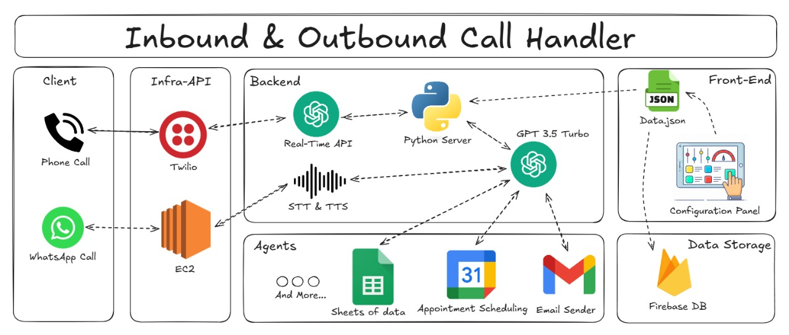
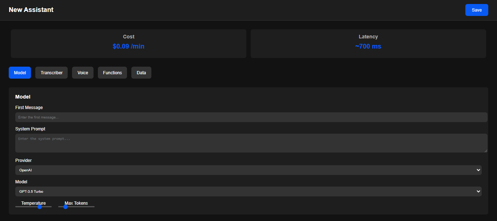
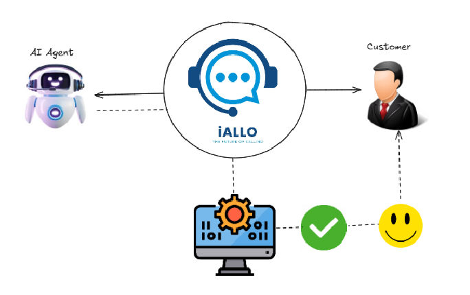

# I-AllO: Your Affordable CallBot Solution

[Watch the video](https://github.com/user-attachments/assets/65c7a9cf-4cb6-413c-a8b5-e483f34b27ab)

I-AllO is a cost-effective CallBot solution built with Python, Twilio Voice (including Media Streams), and OpenAI's Realtime API. It enables seamless phone and WhatsApp communication between clients, agents, and backend services.

**Key Features:**

* **Inbound/Outbound Calls:** Handles both inbound and outbound calls via phone (Twilio) and WhatsApp (EC2).
* **AI-Powered Conversations:** Leverages OpenAI's Realtime API for intelligent, natural-sounding conversations.
* **Scalable Architecture:** Modular design allows for easy expansion and integration with other services.
* **Agent Tools:** Provides agents with access to Google Sheets, Google Calendar, and Gmail for efficient workflow.
* **Customizable Dashboard:** A user-friendly configuration panel built with JSON data on visiting our website:
[https://iallo.surge.sh/dash-main.html](iallo.surge.sh/dash-main.html).
* **Secure Data Storage:** Utilizes Firebase for secure data and log storage.

**Architecture:**

I-AllO uses a multi-component architecture:

1. **Client Communication:** Clients interact via phone calls (Twilio) or WhatsApp calls (EC2).
2. **Infra-API:** Manages real-time call handling and routes requests to the backend.
3. **Backend:** A Python server integrates OpenAI's Realtime API, handles STT/TTS, and manages communication logic.
4. **Agent Tools:** Agents access operational tools like Google Sheets, Google Calendar, and Gmail.
5. **Front-End:** A configurable dashboard manages I-AllO Assistant settings (model selection, system prompt, LLM provider, temperature, max tokens, transcription/voice providers, language, voice cloning, background noise reduction, email address, and more data).
6. **Data Storage:** Firebase Database stores system data and logs securely.

**Use Cases:**

I-AllO offers solutions for various industries, including:

* **Customer Support:** Automate interactions and streamline support processes.
* **Sales Automation:** Enhance sales efficiency with AI-driven call handling.
* **Lead Generation:** Capture and qualify leads effectively.
* **Appointment Scheduling:** Simplify scheduling with automated call handling.
* **Voice Products:** Develop custom voice solutions tailored to your business needs.

**Technology Stack:**

* Python
* Twilio Voice (TwiML, Media Streams)
* Twilio Phone Numbers
* OpenAI Realtime API
* EC2 (for WhatsApp integration)
* Google Sheets, Google Calendar, Gmail
* Firebase Database

## Prerequisites

* **Python 3.9+** (We used `3.9.13`): [Download](https://www.python.org/downloads/)
* **Twilio account**: [Sign up](https://www.twilio.com/try-twilio)
* **Twilio number with Voice capabilities**: [Purchase](https://help.twilio.com/articles/223135247-How-to-Search-for-and-Buy-a-Twilio-Phone-Number-from-Console)
* **OpenAI account and API Key**: [Sign up](https://platform.openai.com/)
* **AWS Account (for WhatsApp integration):** [Sign up](https://aws.amazon.com/)

## Local Setup

To set up I-AllO locally, follow these steps:

1. **Install Dependencies:** Make sure you have Python 3.9+ installed. Then, create a virtual environment (recommended) and install the required packages using `pip install -r requirements.txt`.
2. **Configure Twilio:** Obtain a Twilio account, purchase a phone number with Voice capabilities, and set the necessary environment variables in the `.env` file.
3. **Configure OpenAI:** Create an OpenAI account, obtain an API key with Realtime API access, and set the `OPENAI_API_KEY` in the `.env` file.
4. **Configure AWS (for WhatsApp):** If you intend to use the WhatsApp integration, set up an AWS account and configure the necessary credentials in the `.env` file. (See the AWS setup section for detailed instructions).
5. **Update the .env file:** Fill in all the required environment variables in the `.env` file with your credentials.
6. **Run the application:** Start the application using `python WhatsappBot.py`.

**Pricing and Support:**

I-AllO provides a variety of pricing plans to suit different business requirements, from the Starter plan with basic features to the Enterprise plan offering custom solutions and dedicated support. For more details, visit our website: [https://iallo.surge.sh](iallo.surge.sh).

**Demo Video Link:**
https://drive.google.com/file/d/1ks1iJH1oGigfSrmTN-pWQyPlFJXzODwM/view?usp=drive_link

For any inquiries or support, feel free to reach out through our contact [iallo@gmail.com](imaf.pro@gmail.com). We are here to assist you in transforming your business with AI-powered call solutions.
