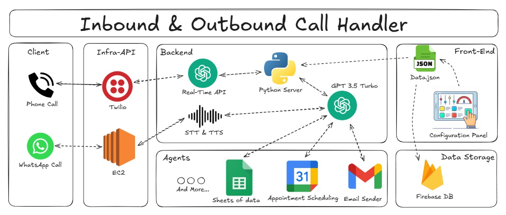
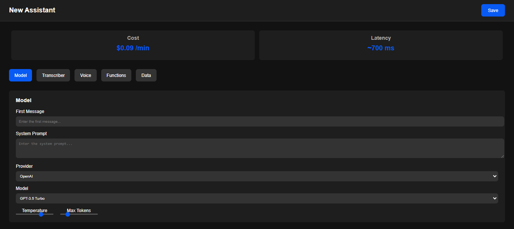
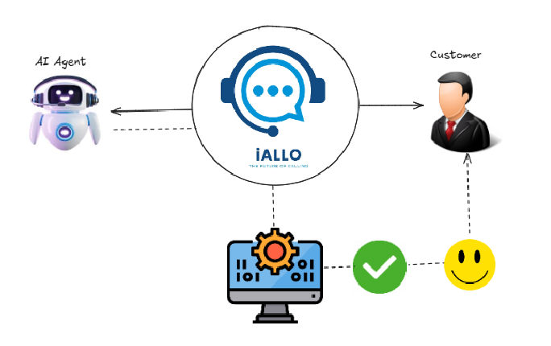
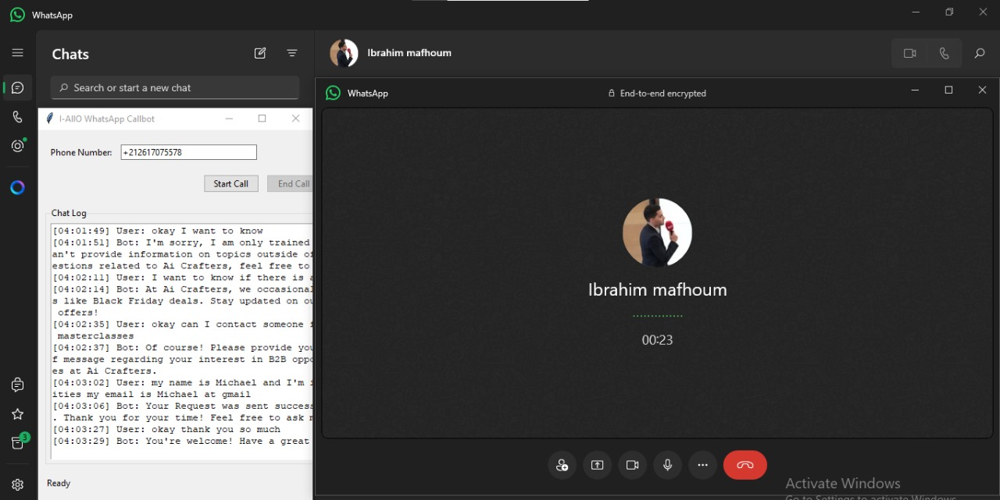

# 📞🤖 I-AllO: Your Affordable WhatsApp Based AI-Powered CallBot Solution

[](https://github.com/user-attachments/assets/65c7a9cf-4cb6-413c-a8b5-e483f34b27ab)

I-AllO is a cost-effective, intelligent CallBot solution designed to revolutionize client communication. Built with Python, Twilio Voice (including Media Streams), and OpenAI's Realtime API, it facilitates seamless phone and WhatsApp interactions between clients, agents, and backend services.

---

## 🔹 **Key Features**

- **📞 Inbound/Outbound Calls:** Effortlessly handle phone and WhatsApp communications.
- **🤖 AI-Powered Conversations:** Powered by OpenAI's Realtime API for intelligent, natural-sounding interactions.
- **🌐 Scalable Architecture:** Modular design ensures easy integration and scalability.
- **📅 Agent Tools:** Seamless integration with Google Sheets, Google Calendar, and Gmail for enhanced productivity.
- **🎨 Customizable Dashboard:** User-friendly interface for configuring models, prompts, and parameters via JSON data.

---

## 🔹 **Architecture Overview**

I-AllO leverages a multi-component architecture to ensure efficiency and scalability:



1. **📢 Client Communication:** Handles client calls via Twilio (phone) and EC2 (WhatsApp).
2. **📡 Infra-API:** Manages real-time call handling and backend request routing.
3. **💻 Backend:** Integrates OpenAI's Realtime API for Speech-to-Text (STT), Text-to-Speech (TTS), and intelligent communication logic.
4. **🔧 Agent Tools:** Provides access to Google productivity tools for streamlined workflows.
5. **🌐 Front-End Dashboard:** Configure the assistant settings, including LLM provider, voice cloning, transcription services, and more.

---

## 🔹 **Customizable Dashboard**

I-AllO includes a user-friendly dashboard to configure the assistant:



You can manage:
- Model selection
- System prompts
- Language
- Transcription/Voice providers
- Background noise reduction
- Email integrations
- And much more!

---

## 🔹 **Use Cases**

I-AllO provides solutions tailored for a variety of industries:

- **📢 Customer Support:** Automate interactions and streamline support processes.
- **🚀 Sales Automation:** Boost sales efficiency with AI-driven call handling.
- **🔍 Lead Generation:** Capture and qualify leads effectively.
- **📅 Appointment Scheduling:** Simplify scheduling with automated call handling.
- **🎧 Voice Products:** Create custom voice solutions for your business.



---

## 🔹 **Technology Stack**

- **Programming Language:** Python
- **Voice Integration:** Twilio Voice (TwiML, Media Streams)
- **WhatsApp Integration:** EC2 for externel whatsapp communication
- **AI Services:** OpenAI Realtime API
- **Productivity Tools:** Google Sheets, Google Calendar, Gmail

---

## 🔹 **Prerequisites**

Ensure you have the following:

- **Python 3.9+**: [Download Python](https://www.python.org/downloads/)
- **Twilio Account:** [Sign up for Twilio](https://www.twilio.com/try-twilio)
- **Twilio Number:** Purchase a Voice-capable phone number: [Guide](https://help.twilio.com/articles/223135247-How-to-Search-for-and-Buy-a-Twilio-Phone-Number-from-Console)
- **OpenAI Account:** Obtain an API Key: [Sign up](https://platform.openai.com/)
  
### Install VB-Audio Cable

Note: You need two separate Virtual Audio Cables. I am using VB Audio Cable and (VAC) Virtual Audio Cable. Install both.

- [Download VB-Audio Cable](https://vb-audio.com/Cable/)


### Install Whatsapp Desktop Version

[Download Whatsapp](ms-windows-store://pdp/?productid=9NKSQGP7F2NH&mode=mini&cid=sideload_experiment_control)


  ---

## 🔹 **Desktop App**

I-AllO also includes a desktop application built using Tkinter (Python). The app, `DesktopApp.py`, allows users to:

- Enter a phone number and initiate WhatsApp calls.
- View real-time logs of call activities.

To use the desktop app, simply run the script:

```bash
python DesktopApp.py
```



---

## 🔹 **Local Setup**

Follow these steps to set up I-AllO locally:

1. **Install Dependencies:**
   - Ensure Python 3.9+ is installed.
   - Create a virtual environment (recommended).
   - Install dependencies using:
     ```bash
     pip install -r requirements.txt
     ```

2. **Configure Twilio:**
   - Sign up for Twilio and purchase a Voice-capable number.
   - Set environment variables in the `.env` file.

3. **Configure OpenAI:**
   - Obtain an API key and set the `OPENAI_API_KEY` in the `.env` file.

4. **Configure AWS (WhatsApp Integration):**
   - Set up AWS credentials for WhatsApp integration. See detailed instructions in the AWS setup section.

5. **Update `.env` File:**
   - Fill in all necessary credentials (Twilio, OpenAI, AWS) in the `.env` file.

6. **Run the Application:**
   - Start the bot using:
     ```bash
     python WhatsappBot.py
     ```

---

## 🔹 **Pricing and Support**

I-AllO offers flexible pricing plans:

- **🌐 Starter Plan:** Basic features for small businesses.
- **💼 Enterprise Plan:** Custom solutions with dedicated support.

For more details, visit our website: [I-AllO Website](https://iallo.surge.sh)

---

## 📹 **Demo Video**

Watch the demo: [Click Here](https://drive.google.com/file/d/1ks1iJH1oGigfSrmTN-pWQyPlFJXzODwM/view?usp=drive_link)

---


## 🔹 **Prospective Features**

We are continuously innovating and working on exciting new features to enhance I-AllO:

- **🔊 Bulk CSV Uploads:** Upload a CSV file with multiple phone numbers to automate sequential call handling.
- **🔍 Direct WhatsApp Connection:** Seamless integration with WhatsApp accounts using QR code authentication.
- **🚀 Multi-Platform Plugin:** Support for various platforms to ensure a consistent experience across devices.
- **📊 Interactive Dashboard:** Real-time insights and analytics to monitor and manage calls effectively.
- **🌐 Multi-Service Provider Integration:** Expand support for additional TTS, STT, and AI providers for enhanced customization.
- **🚑 Human Intervention:** Enable manual intervention for emergency situations to ensure a seamless client experience.

Stay tuned for updates as we bring these features to life!

---


## 🔹 **Contact Us**

Have questions or need support? Reach out to us:

- **Email:** [imaf.pro@gmail.com](mailto:imaf.pro@gmail.com)
- **Website:** [I-AllO Website](https://iallo.surge.sh)

We’re here to help you transform your business with AI-powered call solutions! 🌐


